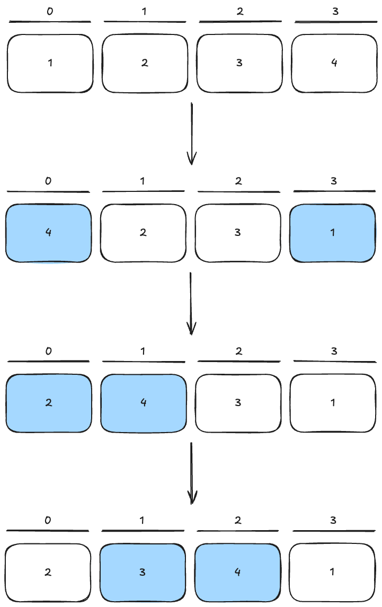
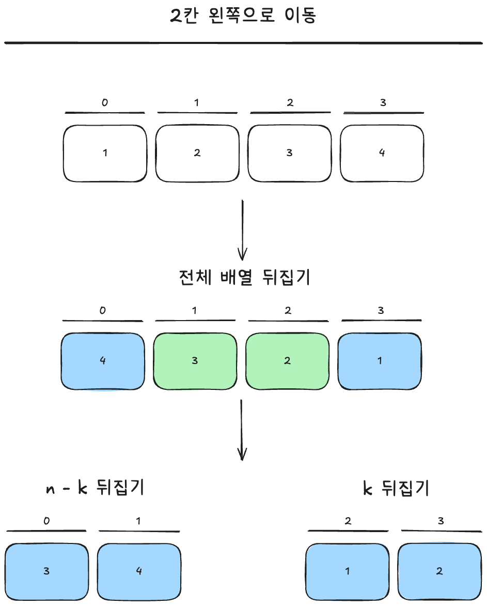

# Q1. Cyclically Shift Rows and Columns

- **문제 링크:** [LeetCode 4052. Cyclically Shift Rows and Columns](https://leetcode.com/problems/cyclically-shift-rows-and-columns/description/)
- **문제 유형:** Matrix
- **결과 상태:** [x] 🟢 성공 | [ ] 🟡 시도했으나 시간 내 미해결 | [ ] 🔴 시간 부족으로 손도 못 댐

## 🟢 [성공 복기]

- **풀이 소요 시간**: 49분
- **핵심 아이디어:**
  - 임시 매트릭스 없이 행 또는 열의 요소 중 $n-1$ 개의 요소를 한 칸 씩 *shift*하면서 `swap`함
    
  - 총 $n$칸 이동 시 위의 과정을 `n`번 반복함
- **복잡도:**
  - 시간 복잡도: $O(N^2)$ (배열 1회 순회 및 빈도 수 계산)
  - 공간 복잡도: $O(1)$

## 🔍 시행착오 & 복기 (Good & Bad)

- **Good**:
  추가 공간 사용 없이 기존 매트릭스에서 `swap`을 통해 _shift_
- **Bad**:
  - 추가 공간 사용을 생각해내지 못해 문제 풀이 시간이 오래 걸림

## 📝 시행착오 기록 (Fail History)

- 해당 없음

## 🤔 추가로 생각해볼만한 풀이

- 배열 뒤집기 (row shift만 해당)
  
  - 수학적 증명
    - ① 배열 전체 뒤집기 시 인덱스
      $i_{1} = (N - 1) - i$
    - ② 앞의 $N - K$ 배열 뒤집기 시 인덱스
      $$
          \begin{aligned}
          i_{2} &= (K - 1) - i_{1} \\
          &= (K - 1) - ((N - 1) - i) \\
          &= K + i - N
          \end{aligned}
      $$
    - ③ 뒤의 $k$ 배열 뒤집기 시 인덱스
      $$
          \begin{aligned}
          i_{3} &= K + (N - 1) - i_{1} \\
          &= K + (N - 1) - ((N - 1) - i) \\
          &= K + i
          \end{aligned}
      $$
    - ②, ③번 인덱스를 $N$으로 나눈 나머지는 $(i + K) (mod N)$ 로 값이 동일하므로 모든 요소는 다음과 같이 귀결
      $$\forall i \in [0, N-1], \quad i_3 = (i + K) \pmod N$$
    - 따라서 "전체 뒤집기 $\rightarrow$ 앞 $K$개 뒤집기 $\rightarrow$ 뒤 $N-K$개 뒤집기" 과정은 정확히 오른쪽으로 $K$칸 Cyclic Shift 하는 연산과 수학적으로 완벽히 동치임이 증명

## 💡 한 줄 총평

> 문제에 추가 공간 사용 제한 조건이 없었으므로 추가 공간을 사용했다면 더 빠르게 해결할 수 있었음

## 코드

<details>
<summary><b>Java Solution (Click to expand)</b></summary>

```java
class Solution {
    public int[][] cyclicShift(int n, int[][] grid, int[] rowShift, int[] colShift) {
       for (int i = 0; i < rowShift.length; i++) {

            int k = rowShift[i];

            while (k-- > 0) {
                rowShift(grid, i);
            }
        }

        for (int i = 0; i < colShift.length; i++) {

            int k = colShift[i];

            while (k-- > 0) {
                colShift(grid, i);
            }
        }

        return grid;
    }

    private void rowShift(int[][] grid, int row) {

        int n = grid.length;
        for (int i = 0; i < n - 1; i++) {
            int temp = grid[row][i];
            grid[row][i] = grid[row][(n + i - 1) % n];
            grid[row][(n + i - 1) % n] = temp;
        }
    }

    private void colShift(int[][] grid, int col) {

        int n = grid.length;
        for (int i = 0; i < n - 1; i++) {
            int temp = grid[i][col];
            grid[i][col] = grid[(n + i - 1) % n][col];
            grid[(n + i - 1) % n][col] = temp;
        }
    }
}
```

## </details>

<br>

# Q2. Minimum Operations to Make Every Element Palindromic

- **문제 링크:** [LeetCode 4053. Minimum Operations to Make Every Element Palindromic
  ](https://leetcode.com/problems/minimum-operations-to-make-every-element-palindromic/)
- **문제 유형:** Math
- **결과 상태:** [ ] 🟢 성공 | [x] 🟡 시도했으나 시간 내 미해결 | [ ] 🔴 시간 부족으로 손도 못 댐

---

## 🟡 [시간 내 미해결 복기]

- **놓친 핵심 아이디어:**
  - Palindromic Number 배열을 미리 생성하여 주어진 수와 가까운 값을 설정했어야 함

## 🔍 시행착오 & 복기 (Good & Bad)

- **Good**:
  - 주어진 수가 짝수, 홀수 시 로직이 달라야한다는 것만 알아챔
- **Bad**:
  - palindromic하지 않은 수를 Palindromic Number로 변경하여 카운트하려고 함
    - 주어진 조건은 해당 수에 가장 가까운 Palindromic Number를 고려하는 것이었음

## **해당 문제에서 새로 알게 된 알고리즘/테크닉:**

- Palindromic Number 생성 알고리즘
  - 자릿수를 기준으로 Palindromic Number의 앞자리를 먼저 설정한 후 reverse하여 자릿수에 맞게 뒷자리에 붙임

    ```java
    for (int len = 1; len < 10; len++) {
            int half = (len + 1) / 2;
            long start = pow(10, half - 1);
            long end = pow(10, half);

            for (long i = start; i < end; i++) {
                String s = Long.toString(i);
                String r = new StringBuilder(s).reverse().toString();

                long palindromicNumber =
                    len % 2 == 0 ? Long.valueOf(s + r) : Long.valueOf(s + r.substring(1));

                if (palindromicNumber % 2 == 0) {
                    palindromicEvenNumber.add(palindromicNumber);
                } else {
                    palindromicOddNumber.add(palindromicNumber);
                }
            }
        }

    ```

  - `Collections.binarySearch`의 작동 원리
    - `target`이 되는 수를 찾으면 해당 인덱스를, 못 찾으면 `-(low + 1)`을 반환
    - 가장 가까운 수를 찾을 때, 이진 탐색 결과가 $0$보다 작으면 결과값에 $+1$ 하여 탐색 가능

## 📝 시행착오 기록 (Fail History)

- [x] **시도 1:** 가장 가까운 Palindromic Number를 고려하는 것이 아닌 해당 수를 Palindromic Number로 변경하여 Operations 수를 과도하게 부풀림

## 💡 한 줄 총평

> 미리 Palindromic Number를 생성하여 짝수, 홀수 케이스를 나누어 고려했다면 시간 내에 풀 수 있었다고 판단됨

## 코드

<details>
<summary><b>Java Solution (Click to expand)</b></summary>

```java
class Solution {
    static List<Long> palindromicOddNumber = new ArrayList<>();
    static List<Long> palindromicEvenNumber = new ArrayList<>();

    static {
        for (int len = 1; len < 10; len++) {
            int half = (len + 1) / 2;
            long start = pow(10, half - 1);
            long end = pow(10, half);

            for (long i = start; i < end; i++) {
                String s = Long.toString(i);
                String r = new StringBuilder(s).reverse().toString();

                long palindromicNumber =
                    len % 2 == 0 ? Long.valueOf(s + r) : Long.valueOf(s + r.substring(1));

                if (palindromicNumber % 2 == 0) {
                    palindromicEvenNumber.add(palindromicNumber);
                } else {
                    palindromicOddNumber.add(palindromicNumber);
                }
            }
        }
    }

    public long minOperations(int[] nums) {

        long count = 0;

        for (int num : nums) {

            if (num % 2 == 0) {
                count += getMinDiff(palindromicEvenNumber, num) / 2;
            } else {
                count += getMinDiff(palindromicOddNumber, num) / 2;
            }
        }

        return count;
    }

    private static long pow(int base, int digit) {
        long result = 1;

        while (digit-- > 0) {
            result *= 10;
        }

        return result;
    }

    private long getMinDiff(List<Long> palindromicNumbers, long number) {

        int index = Collections.binarySearch(palindromicNumbers, number);

        if (index >= 0) {
            return 0;
        }

        index = -index - 1;

        if (index == 0) {
            return palindromicNumbers.get(index) - number;
        }

        if (index == palindromicNumbers.size()) {
            return number - palindromicNumbers.get(index - 1);
        }

        return Math.min(palindromicNumbers.get(index) - number,
            number - palindromicNumbers.get(index - 1));
    }
}
```

</details>
<br>

# Q3. Count Shadow Pairs I

- **문제 링크:** [LeetCode 4054. Count Shadow Pairs I](https://leetcode.com/problems/count-shadow-pairs-i/description/)
- **문제 유형:** Monotoic stack
- **결과 상태:** [ ] 🟢 성공 | [ ] 🟡 시도했으나 시간 내 미해결 | [x] 🔴 시간 부족으로 손도 못 댐

## 🔴 읽지도 못한 문제 복기

- **지문을 못 읽은 원인:** 1번 문제 풀이에 시간을 많이 잡아 먹고, 2번 문제 풀이 방향을 잘못 잡아 손도 댈 수 없었음
- **대회 후 지문 확인 결과:**
  - [ ] 시간만 있었으면 풀 수 있었던 아쉬운 문제
  - [x] 어차피 개념/알고리즘을 몰라 당장 못 풀었을 문제

### **해당 문제에서 새로 알게 된 알고리즘/테크닉:**

- Monotonic Stack
  - 적용 기준
    - 두 인덱스 $(i, j)$ 사이의 모든 값이 특정 기준 `i < k < j and nums[k] < nums[i] < nums[j]`을 충족해야 하는가?
    - 위의 조건을 만족하기 위해 '자신보다 왼쪽에 위치한 값들 중 큰 값이 존재하는가?' 판단  
      큰 값이 존재하는 경우 조건을 만족하지 않으므로 `pop()`하여 단조 비감수(monotonic non-decreasing) 상태 유지

## 💡 한 줄 총평

> 문제의 조건을 보고 단조 스택임을 깨달을 수 있다면 쉽게 풀 수 있는 문제였다.

## 코드

<details>
<summary><b>Java Solution (Click to expand)</b></summary>

```java
public class Solution {

    long count = 0;
        int k = 0;
        int[] stack = new int[nums.length];

        for (int num : nums) {
            while (k > 0 && stack[k - 1] > num) {
                k--;
            }

            int l = 0;
            int r = k;
            while (l < r) {
                int mid = l + (r - l) / 2;
                if (stack[mid] < num) {
                    l = mid + 1;
                } else {
                    r = mid;
                }
            }

            count += l;
            stack[k++] = num;
        }

        return count;
}

```

</details>
<br>

# Q4. Count Shadow Pairs II

- **문제 링크:** [LeetCode 4055. Count Shadow Pairs II](https://leetcode.com/problems/count-shadow-pairs-ii/description/)
- **문제 유형:** Segment Tree
- **결과 상태:** [ ] 🟢 성공 | [ ] 🟡 시도했으나 시간 내 미해결 | [x] 🔴 시간 부족으로 손도 못 댐

## 🔴 읽지도 못한 문제 복기

- **지문을 못 읽은 원인:** 1번 문제 풀이에 시간을 많이 잡아 먹고, 2번 문제 풀이 방향을 잘못 잡아 손도 댈 수 없었음
- **대회 후 지문 확인 결과:**
  - [ ] 시간만 있었으면 풀 수 있었던 아쉬운 문제
  - [x] 어차피 개념/알고리즘을 몰라 당장 못 풀었을 문제

### **해당 문제에서 새로 알게 된 알고리즘/테크닉:**

- **테크닉**
  `i < k < j and nums[i] < nums[k] < nums[j]` 조건을 양쪽에서 챙겨야하므로 monotonic stack이 아닌 오른쪽으로 스위핑하며 이전 원소들의 '시야 한계선'을 갱신하는 2차원 구간 쿼리 문제
- **알고리즘**
  - Sweeping + Segment Tree Beats + Coordinate Compression

## 💡 한 줄 총평

> 너무 어렵다...

## 다른 사람이 풀은 코드

<details>
<summary><b>Java Solution (Click to expand)</b></summary>

```java
public class Solution {

    static final int INF = 1000000007;
    static final int NEG = -1;

    int[] mx, second, mn, cntMx, active, lazy;

    void build(int node, int l, int r) {
        mx[node] = NEG;
        second[node] = NEG;
        mn[node] = INF;
        cntMx[node] = 0;
        active[node] = 0;
        lazy[node] = INF;

        if (l == r)
            return;

        int mid = (l + r) >>> 1;
        build(node << 1, l, mid);
        build(node << 1 | 1, mid + 1, r);
    }

    void applyChmin(int node, int x) {
        if (mx[node] <= x)
            return;

        mn[node] = Math.min(mn[node], x);
        mx[node] = x;
        lazy[node] = Math.min(lazy[node], x);
    }

    void push(int node) {
        if (lazy[node] != INF) {
            applyChmin(node << 1, lazy[node]);
            applyChmin(node << 1 | 1, lazy[node]);
            lazy[node] = INF;
        }
    }

    void pull(int node) {
        int left = node << 1;
        int right = left | 1;

        mn[node] = Math.min(mn[left], mn[right]);
        active[node] = active[left] + active[right];

        if (mx[left] > mx[right]) {
            mx[node] = mx[left];
            cntMx[node] = cntMx[left];
            second[node] = Math.max(second[left], mx[right]);
        } else if (mx[left] < mx[right]) {
            mx[node] = mx[right];
            cntMx[node] = cntMx[right];
            second[node] = Math.max(mx[left], second[right]);
        } else {
            mx[node] = mx[left];
            cntMx[node] = cntMx[left] + cntMx[right];
            second[node] = Math.max(second[left], second[right]);
        }
    }

    void insert(int node, int l, int r, int pos) {
        if (l == r) {
            mx[node] = INF;
            second[node] = NEG;
            mn[node] = INF;
            cntMx[node] = 1;
            active[node] = 1;
            lazy[node] = INF;
            return;
        }

        push(node);

        int mid = (l + r) >>> 1;

        if (pos <= mid) {
            insert(node << 1, l, mid, pos);
        } else {
            insert(node << 1 | 1, mid + 1, r, pos);
        }

        pull(node);
    }

    void rangeChmin(int node, int l, int r, int ql, int qr, int x) {
        if (ql > r || qr < l || active[node] == 0 || mx[node] <= x) {
            return;
        }

        if (ql <= l && r <= qr && second[node] < x) {
            applyChmin(node, x);
            return;
        }

        push(node);

        int mid = (l + r) >>> 1;

        rangeChmin(node << 1, l, mid, ql, qr, x);
        rangeChmin(node << 1 | 1, mid + 1, r, ql, qr, x);

        pull(node);
    }

    int query(int node, int l, int r, int ql, int qr, int x) {
        if (ql > r || qr < l || active[node] == 0 || mx[node] < x) {
            return 0;
        }

        if (ql <= l && r <= qr && mn[node] >= x) {
            return active[node];
        }

        if (l == r) {
            return mx[node] >= x ? active[node] : 0;
        }

        push(node);

        int mid = (l + r) >>> 1;

        return query(node << 1, l, mid, ql, qr, x)
            + query(node << 1 | 1, mid + 1, r, ql, qr, x);
    }

    public int shadowPairs(int[] nums) {
        int n = nums.length;
        long[] order = new long[n];

        for (int i = 0; i < n; i++) {
            order[i] = ((long) nums[i] << 32) | (i & 0xffffffffL);
        }

        Arrays.sort(order);

        int[] rank = new int[n];

        for (int i = 0; i < n; i++) {
            rank[(int) order[i]] = i;
        }

        mx = new int[4 * n];
        second = new int[4 * n];
        mn = new int[4 * n];
        cntMx = new int[4 * n];
        active = new int[4 * n];
        lazy = new int[4 * n];

        build(1, 0, n - 1);

        long res = 0;

        for (int j = 0; j < n; j++) {
            int b = nums[j];
            int right = lowerBound(order, b) - 1;

            if (right >= 0) {
                res += query(1, 0, n - 1, 0, right, b);
            }

            insert(1, 0, n - 1, rank[j]);

            int left = lowerBound(order, nums[j]) - 1;

            if (left >= 0) {
                rangeChmin(
                    1, 0, n - 1, 0, left, nums[j]);
            }
        }

        return (int) res;
    }

    int lowerBound(long[] order, int target) {
        int left = 0, right = order.length;

        while (left < right) {
            int mid = left + (right - left) / 2;
            int val = (int) (order[mid] >>> 32);

            if (val < target) {
                left = mid + 1;
            } else {
                right = mid;
            }
        }

        return left;
    }
}

```

</details>
